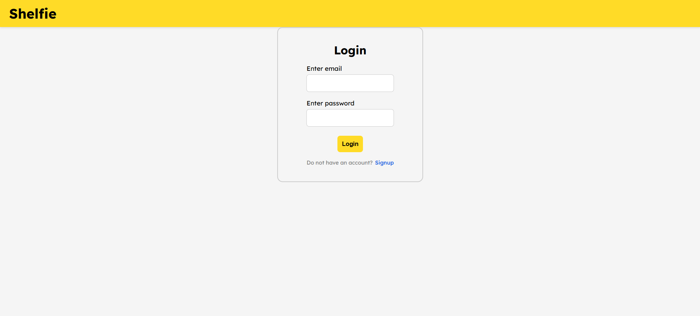

<p align="center">
  
</p>

# Shelfie 🎯

## Basic Details

### Team Name: blubyte

### Team Members
- Member 1: Anagha K - NSS College of Engineering, Palakkad

### Hosted Project Link
https://shelfie-93cb0.web.app

### Project Description
Shelfie is a smart inventory and shopping assistant that helps users:
- Track expiry dates of food, medicines, skincare, and household products
- Scan barcodes to automatically fetch product details
- Receive timely reminders before items expire
- Create an intelligent “To-Buy” list that auto-categorizes items by supermarket sections
By combining barcode scanning, product data APIs, and smart categorization, Shelfie reduces waste, improves safety, and makes shopping more organized and efficient.

### The Problem statement
In everyday households, people often forget the expiry dates of food, medicines, and personal care products. This leads to food waste, health risks from expired medicines, and unnecessary repurchases of items already available at home. Additionally, while shopping in supermarkets, unorganized grocery lists cause confusion, repeated walking between sections, and inefficient shopping.
There is a need for a simple, smart system that helps users track product expiry dates and organize shopping more efficiently.

### The Solution
By introducing expiry date trackers to track expiry dates efficiently and email notifications before expiry
By providing a basic yet smart 'to buy' list easy to use
Enter an item with least number of clicks maximising user convenience

---

## Technical Details

### Technologies/Components Used

**For Software:**
- Languages used: HTML, CSS & JavaScript
- Frameworks used: Firebase (Authentication & Firestore Database)
EmailJS (Email notifications)
- Libraries used: QuaggaJS (Barcode scanning)
Firebase SDK v10.12.0
Material Symbols (Icons)
Lexend Font (Typography)
- Tools used: VS Code (Development)
Git (Version control)
Firebase Hosting (Deployment)
Cloudflare Workers (AI service)
Groq API (AI categorization)
Open Food Facts API (Product database)
Open Beauty Facts API (Product database)

**For Hardware:**
- Main components: [List main components]
- Specifications: [Technical specifications]
- Tools required: [List tools needed]

---

## Features

List the key features of your project:
- Feature 1: Smart Auto-Categorizing To-Buy List : Automatically organizes shopping items into 8 categories using keyword matching with AI fallback for unknown products.
- Feature 2: Multi-Shelf Expiry Date Tracker : Track product expiry dates across 4 shelves with color-coded alerts
- Feature 3: Barcode Scanner & Product Search : Scan product barcodes or search by name to auto-fill product information using Open Food Facts and Open Beauty Facts databases. Supports EAN, UPC, and Code 128 barcode formats.
- Feature 4: Smart Email Notifications : Receives daily email digests for items nearing expiry with customizable reminder periods (months + days before expiry). Includes urgency summary showing expired, expiring soon (≤3 days), and expiring this week (4-7 days) items.
- - Feature 5: Manufacturing Date Calculator : Calculate expiry dates from manufacturing date + best before period (years, months, days) for products that don't have explicit expiry dates printed.

---

## Implementation

### For Software:

#### Installation
```bash
npm install -g firebase-tools
npm install -g wrangler
```

#### Run
```bash
git clone https://github.com/yourusername/shelfie.git
cd shelfie
npm install
firebase login
wrangler login
```

### For Hardware:

#### Components Required
[List all components needed with specifications]

#### Circuit Setup
[Explain how to set up the circuit]

---

## Project Documentation

### For Software:

#### Screenshots (Add at least 3)




#### Diagrams

**System Architecture:**


*Explain your system architecture - components, data flow, tech stack interaction*

**Application Workflow:**


*Add caption explaining your workflow*

---

### For Hardware:

#### Schematic & Circuit


*Add caption explaining connections*


*Add caption explaining the schematic*

#### Build Photos


*List out all components shown*


*Explain the build steps*


*Explain the final build*

---

## Additional Documentation

### For Web Projects with Backend:

## Additional Documentation

### API Documentation

Shelfie uses multiple APIs to provide comprehensive functionality. Below is the complete API reference.

---

#### 1. Shelfie AI Categorization API (Cloudflare Worker)

**Base URL:** `https://shelfie-worker.shelfie-worker.workers.dev`

##### Endpoints

**POST /**
- **Description:** Categorizes a product into one of 8 predefined categories using AI (Groq LLaMA 3 70B model)
- **Authentication:** None required
- **Request Body:**
```json
{
  "productName": "string"
}
```
- **Response (Success):**
```json
{
  "category": "food-groceries",
  "debug": {
    "productName": "kombucha",
    "rawAI": "snack-beverages",
    "cleanedAI": "snack-beverages",
    "valid": true
  }
}
```
- **Response (Error):**
```json
{
  "error": "AI service unavailable",
  "category": null
}
```
- **Status Codes:**
  - `200` - Success
  - `400` - Bad Request (missing productName)
  - `405` - Method Not Allowed (only POST accepted)
  - `500` - Internal Server Error (AI service unavailable)

- **Valid Categories:**
  - `food-groceries`
  - `diary-bakery`
  - `snack-beverages`
  - `personal-care`
  - `laundry-cleaning`
  - `health-pharmacy`
  - `household`
  - `stationary`

- **Example Request:**
```bash
curl -X POST https://shelfie-worker.shelfie-worker.workers.dev \
  -H "Content-Type: application/json" \
  -d '{"productName":"quinoa"}'
```

- **Example Response:**
```json
{
  "category": "food-groceries",
  "debug": {
    "productName": "quinoa",
    "rawAI": "food-groceries",
    "cleanedAI": "food-groceries",
    "valid": true
  }
}
```

---

#### 2. Open Food Facts API (External)

**Base URL:** `https://world.openfoodfacts.org/api/v0`

##### Endpoints

**GET /product/{barcode}.json**
- **Description:** Retrieves detailed product information using a barcode
- **Authentication:** None required
- **Parameters:**
  - `barcode` (string, path): Product barcode (EAN-13, UPC-A, etc.)
- **Response:**
```json
{
  "status": 1,
  "product": {
    "product_name": "Nutella",
    "product_name_en": "Nutella",
    "categories": "Spreads, Sweet spreads, Hazelnut spreads",
    "brands": "Ferrero",
    "image_url": "https://images.openfoodfacts.org/...",
    "ingredients_text": "Sugar, Palm Oil, Hazelnuts..."
  }
}
```
- **Status Codes:**
  - `status: 1` - Product found
  - `status: 0` - Product not found

- **Example Request:**
```bash
curl https://world.openfoodfacts.org/api/v0/product/3017620422003.json
```

**GET /cgi/search.pl**
- **Description:** Searches for products by name
- **Authentication:** None required
- **Parameters:**
  - `search_terms` (string, query): Product name to search
  - `json` (integer, query): Set to `1` for JSON response
  - `page_size` (integer, query): Number of results (default: 20)
- **Response:**
```json
{
  "count": 1,
  "page": 1,
  "page_size": 1,
  "products": [
    {
      "product_name": "Coca-Cola",
      "brands": "Coca-Cola",
      "categories": "Beverages, Carbonated drinks",
      "code": "5449000000996"
    }
  ]
}
```

- **Example Request:**
```bash
curl "https://world.openfoodfacts.org/cgi/search.pl?search_terms=coca%20cola&json=1&page_size=1"
```

---

#### 3. Open Beauty Facts API (External)

**Base URL:** `https://world.openbeautyfacts.org/api/v0`

##### Endpoints

**GET /product/{barcode}.json**
- **Description:** Retrieves beauty/cosmetic product information using a barcode
- **Authentication:** None required
- **Parameters:**
  - `barcode` (string, path): Product barcode
- **Response:**
```json
{
  "status": 1,
  "product": {
    "product_name": "Dove Soap",
    "brands": "Dove",
    "categories": "Hygiene, Soaps, Bar soaps",
    "ingredients_text": "Sodium Lauroyl Isethionate..."
  }
}
```

- **Example Request:**
```bash
curl https://world.openbeautyfacts.org/api/v0/product/8711700959605.json
```

**GET /cgi/search.pl**
- **Description:** Searches for beauty products by name
- **Parameters:** Same as Open Food Facts API

---

#### 4. EmailJS API (External)

**Base URL:** `https://api.emailjs.com/api/v1.0`

**Note:** EmailJS is used internally by the client-side JavaScript. Configuration required:

**Configuration:**
```javascript
const EMAILJS_CONFIG = {
    serviceId: 'YOUR_SERVICE_ID',
    templateId: 'YOUR_TEMPLATE_ID',
    publicKey: 'YOUR_PUBLIC_KEY'
};
```

**Template Variables:**
- `to_email` - Recipient email address
- `user_name` - User's display name
- `items_count` - Number of items needing attention
- `summary_text` - Urgency summary text
- `items_list` - Formatted list of expiring items
- `expired_count` - Count of expired items
- `expiring_soon_count` - Count of items expiring ≤3 days
- `expiring_week_count` - Count of items expiring 4-7 days

---

#### 5. Firebase Firestore Database Schema

**Collection:** `shelfItems`

**Document Structure:**
```javascript
{
  productName: "string",           // Product name
  category: "string",              // Shelf category: food|medicine|skincare|household-others
  expiryDate: "ISO 8601 string",   // Expiry date in ISO format
  reminderDate: "ISO 8601 string", // Reminder trigger date in ISO format
  addedDate: "ISO 8601 string",    // Date item was added
  userId: "string"                 // Firebase Auth user ID
}
```

**Example Document:**
```json
{
  "productName": "Milk",
  "category": "food",
  "expiryDate": "2024-02-20T00:00:00.000Z",
  "reminderDate": "2024-02-15T00:00:00.000Z",
  "addedDate": "2024-02-14T10:30:00.000Z",
  "userId": "abc123xyz456"
}
```

**Security Rules:**
```javascript
rules_version = '2';
service cloud.firestore {
  match /databases/{database}/documents {
    match /shelfItems/{itemId} {
      allow read, write: if request.auth != null && request.auth.uid == resource.data.userId;
      allow create: if request.auth != null && request.auth.uid == request.resource.data.userId;
    }
  }
}
```

---

#### 6. localStorage Schema

**Key:** `toBuyLists`

**Structure:**
```javascript
{
  "food-groceries": [
    { "name": "Rice", "checked": false, "id": 1707901234567 },
    { "name": "Pasta", "checked": true, "id": 1707901234568 }
  ],
  "diary-bakery": [
    { "name": "Milk", "checked": false, "id": 1707901234569 }
  ],
  "snack-beverages": [],
  "personal-care": [],
  "laundry-cleaning": [],
  "health-pharmacy": [],
  "household": [],
  "stationary": []
}
```

**Key:** `lastEmailSent`

**Structure:**
```javascript
"Sat Feb 14 2024"  // Date string in toDateString() format
```

---

### Rate Limits & Quotas

| Service | Free Tier Limit | Notes |
|---------|----------------|-------|
| Groq API | 30 requests/min, 14,400 requests/day | Via Cloudflare Worker |
| EmailJS | 200 emails/month | Upgrade for more |
| Open Food Facts | No official limit | Courtesy limit: ~100 requests/min |
| Open Beauty Facts | No official limit | Courtesy limit: ~100 requests/min |
| Cloudflare Workers | 100,000 requests/day | Free tier |
| Firebase Firestore | 50,000 reads/day, 20,000 writes/day | Free tier (Spark plan) |

---

### Error Handling

**Common Error Codes:**

| Code | Description | Solution |
|------|-------------|----------|
| 400 | Bad Request - Invalid parameters | Check request body format |
| 401 | Unauthorized - Auth required | Ensure user is logged in |
| 404 | Not Found - Resource doesn't exist | Verify barcode/product exists |
| 405 | Method Not Allowed | Use correct HTTP method (GET/POST) |
| 429 | Too Many Requests - Rate limit exceeded | Wait and retry with exponential backoff |
| 500 | Internal Server Error | Check server logs, verify API keys |
| 503 | Service Unavailable | External API down, try again later |

**Example Error Response:**
```json
{
  "error": "Product not found",
  "code": 404,
  "message": "The requested barcode does not exist in our database"
}
```

---

### Best Practices

1. **Caching:** Cache Open Food Facts responses to reduce API calls
2. **Retry Logic:** Implement exponential backoff for failed requests
3. **Fallbacks:** Always have a fallback when external APIs fail
4. **Validation:** Validate all user inputs before sending to APIs
5. **Security:** Never expose API keys in client-side code (use environment variables/secrets)

---

### For Mobile Apps:

#### App Flow Diagram


*Explain the user flow through your application*

#### Installation Guide

**For Android (APK):**
1. Download the APK from [Release Link]
2. Enable "Install from Unknown Sources" in your device settings:
   - Go to Settings > Security
   - Enable "Unknown Sources"
3. Open the downloaded APK file
4. Follow the installation prompts
5. Open the app and enjoy!

**For iOS (IPA) - TestFlight:**
1. Download TestFlight from the App Store
2. Open this TestFlight link: [Your TestFlight Link]
3. Click "Install" or "Accept"
4. Wait for the app to install
5. Open the app from your home screen

**Building from Source:**
```bash
# For Android
flutter build apk
# or
./gradlew assembleDebug

# For iOS
flutter build ios
# or
xcodebuild -workspace App.xcworkspace -scheme App -configuration Debug
```

---

### For Hardware Projects:

#### Bill of Materials (BOM)

| Component | Quantity | Specifications | Price | Link/Source |
|-----------|----------|----------------|-------|-------------|
| Arduino Uno | 1 | ATmega328P, 16MHz | ₹450 | [Link] |
| LED | 5 | Red, 5mm, 20mA | ₹5 each | [Link] |
| Resistor | 5 | 220Ω, 1/4W | ₹1 each | [Link] |
| Breadboard | 1 | 830 points | ₹100 | [Link] |
| Jumper Wires | 20 | Male-to-Male | ₹50 | [Link] |
| [Add more...] | | | | |

**Total Estimated Cost:** ₹[Amount]

#### Assembly Instructions

**Step 1: Prepare Components**
1. Gather all components listed in the BOM
2. Check component specifications
3. Prepare your workspace

*Caption: All components laid out*

**Step 2: Build the Power Supply**
1. Connect the power rails on the breadboard
2. Connect Arduino 5V to breadboard positive rail
3. Connect Arduino GND to breadboard negative rail

*Caption: Power connections completed*

**Step 3: Add Components**
1. Place LEDs on breadboard
2. Connect resistors in series with LEDs
3. Connect LED cathodes to GND
4. Connect LED anodes to Arduino digital pins (2-6)

*Caption: LED circuit assembled*

**Step 4: [Continue for all steps...]**

**Final Assembly:**

*Caption: Completed project ready for testing*

---

### For Scripts/CLI Tools:

#### Command Reference

**Basic Usage:**
```bash
python script.py [options] [arguments]
```

**Available Commands:**
- `command1 [args]` - Description of what command1 does
- `command2 [args]` - Description of what command2 does
- `command3 [args]` - Description of what command3 does

**Options:**
- `-h, --help` - Show help message and exit
- `-v, --verbose` - Enable verbose output
- `-o, --output FILE` - Specify output file path
- `-c, --config FILE` - Specify configuration file
- `--version` - Show version information

**Examples:**

```bash
# Example 1: Basic usage
python script.py input.txt

# Example 2: With verbose output
python script.py -v input.txt

# Example 3: Specify output file
python script.py -o output.txt input.txt

# Example 4: Using configuration
python script.py -c config.json --verbose input.txt
```

#### Demo Output

**Example 1: Basic Processing**

**Input:**
```
This is a sample input file
with multiple lines of text
for demonstration purposes
```

**Command:**
```bash
python script.py sample.txt
```

**Output:**
```
Processing: sample.txt
Lines processed: 3
Characters counted: 86
Status: Success
Output saved to: output.txt
```

**Example 2: Advanced Usage**

**Input:**
```json
{
  "name": "test",
  "value": 123
}
```

**Command:**
```bash
python script.py -v --format json data.json
```

**Output:**
```
[VERBOSE] Loading configuration...
[VERBOSE] Parsing JSON input...
[VERBOSE] Processing data...
{
  "status": "success",
  "processed": true,
  "result": {
    "name": "test",
    "value": 123,
    "timestamp": "2024-02-07T10:30:00"
  }
}
[VERBOSE] Operation completed in 0.23s
```

---

## Project Demo

### Video
[Add your demo video link here - YouTube, Google Drive, etc.]

*Explain what the video demonstrates - key features, user flow, technical highlights*

### Additional Demos
[Add any extra demo materials/links - Live site, APK download, online demo, etc.]

---

## AI Tools Used (Optional - For Transparency Bonus)

If you used AI tools during development, document them here for transparency:

**Tool Used:** [e.g., GitHub Copilot, v0.dev, Cursor, ChatGPT, Claude]

**Purpose:** [What you used it for]
- Example: "Generated boilerplate React components"
- Example: "Debugging assistance for async functions"
- Example: "Code review and optimization suggestions"

**Key Prompts Used:**
- "Create a REST API endpoint for user authentication"
- "Debug this async function that's causing race conditions"
- "Optimize this database query for better performance"

**Percentage of AI-generated code:** [Approximately X%]

**Human Contributions:**
- Architecture design and planning
- Custom business logic implementation
- Integration and testing
- UI/UX design decisions

*Note: Proper documentation of AI usage demonstrates transparency and earns bonus points in evaluation!*

---

## Team Contributions

- [Name 1]: [Specific contributions - e.g., Frontend development, API integration, etc.]

---

## License

This project is licensed under the [LICENSE_NAME] License - see the [LICENSE](LICENSE) file for details.

**Common License Options:**
- MIT License (Permissive, widely used)
- Apache 2.0 (Permissive with patent grant)
- GPL v3 (Copyleft, requires derivative works to be open source)

---

Made with ❤️ at TinkerHub
